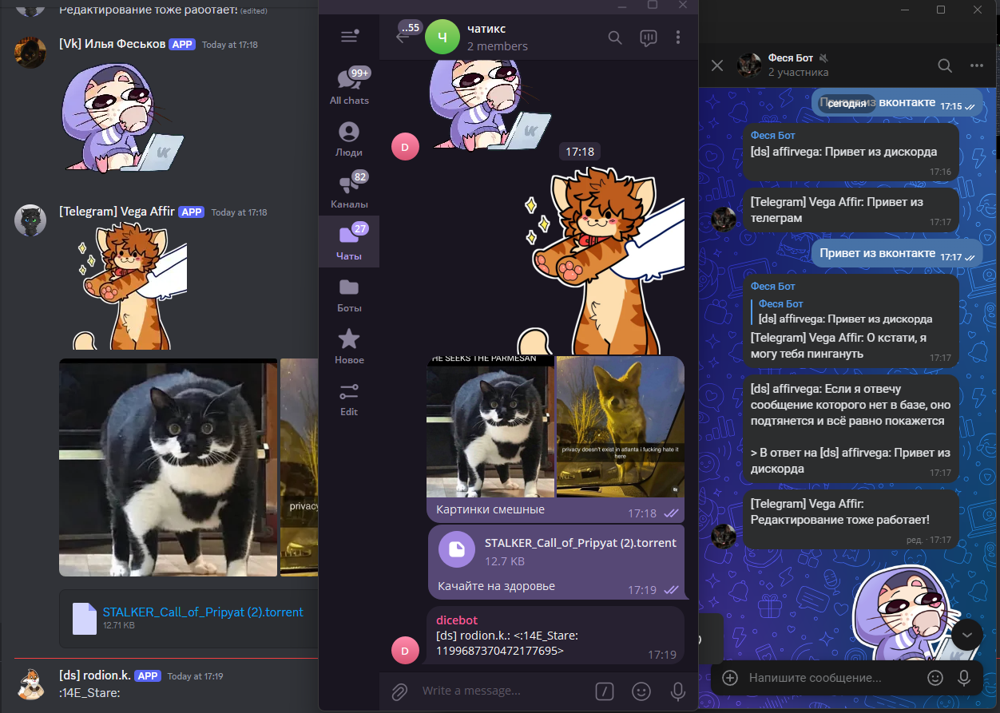

# Bridger - мост между Discord, Telegram, VK
Чисто локальный проект по синхронизации чатов друг с другом.



Функционал приложения:
- Пересылка сообщений, редактирование (из дискорд и телеграм), удаление (из дискорд)
- Поддержка фотографий, файлов, стикеров
- Полноценная поддержка ответов на сообщения, чего нет в matterbridge

## Запуск

```bash
git clone https://github.com/affirvega/bridge
cd bridge

python3 -m venv .venv
source .venv/bin/activate
# Отредактируйте config.yaml.example в config.yaml.
pip install -r requirements.txt

cp .env.example .env
nano .env # отредактируйте .env тут

python3 src/main.py
```

## Конфигурация
Состоит из одного координатора, в которм есть три секции: bots, bridges, chats
В секции bots описываются боты в формате:
```yaml
bots:
    bot_id:
        type: "discord" или "vk" или "telegram"
        token: "токен для бота"
        # name используется для логов
        name: "Дискорд мост"

        # для дискорда:
        # отправлять сообщения через webhook. это сообщения, где можно указать кастомный ник и подтянуть аватарку из другого чата
        webhook: true
        # uploader необходим, потому что прямой ссылки на аватарку в телеграме нет. это сервер, куда можно отправить картинку и она там будет храниться. Я использовал https://github.com/hauxir/imgpush
        uploader: imgpush https://example.com:12345
        # недостатком webhook является что нельзя указать, на какое сообщение отвечает это. Как костыль, в сообщение добавляется embed с сообщением, на которое отвечаем, и если человек есть на сервере, пингуем его
        embed: true
```

В секции bridge мосты просто объявляются. Bridge это объединение чатов, то есть если кто-то написал в одном чате friends, то это сообщение разлетится по другим чатам friends.
```yaml
bridges:
    furries:
    friends:
```

В секции chats объявляются чаты, к какому боту и мосту они привязаны:
```yaml
chats:
    -   id: 41414141414141441414141
        server_id: 41414141414141       # для дискорда
        # id бота который будет владеть чатом
        bot_id: bot_id
        # префикс для сообщений в других чатах
        prefix: ds
        # один из вариантов: в каким мостам принадлежит чат
        bridge: furries
        bridges: [furries, friends]
    # другой чат
    -   id: ....
        ........
```

## Планы по развитию

Из того что планируется

- [ ] аудиосообщения
- [ ] пересланные сообщения
- [ ] vk пересылка через юзербота
- [ ] Каждый канал может только получать и(или) отправлять сообщения (inout)
- [ ] Веб морда с разграничением по количеству чатов
- [ ] апи/консольное управление
- [ ] Документация по проекту и возможность для дополнения другими соцсетями
- [ ] База данных PostgreSQL, MySQL или SQLite